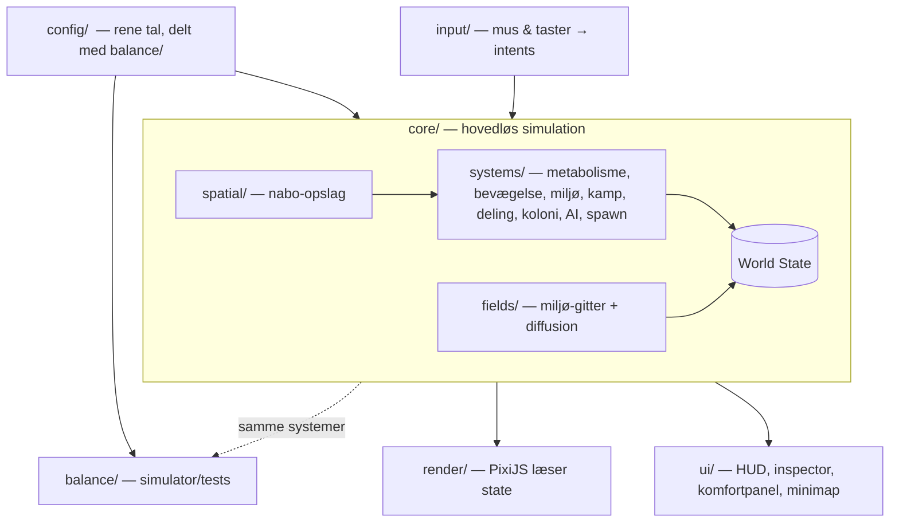

# CellSpil — Teknisk arkitektur-skitse

> Mål-arkitektur for den nye kodebase. Overordnet niveau: moduler, ansvar, dataflow og
> mønstre — ikke færdig kode. Skal bære alle systemerne fra [SPEC.md](SPEC.md),
> [EVOLUTION.md](EVOLUTION.md), [ENVIRONMENT.md](ENVIRONMENT.md), [SOCIAL.md](SOCIAL.md) og
> [ENEMIES.md](ENEMIES.md), og dele tal-laget med [BALANCE.md](BALANCE.md) / `balance/`.

## 1. Hvad gik galt — og principperne der følger

Den gamle kode brød sammen, fordi **alt levede i `Cell.update()`**: bevægelse, metabolisme,
deling, input, rendering og kamp var flettet sammen i én løkke, der muterede tilstanden ad hoc.
Når ét system blev rørt, knækkede tre andre. Tallene lå spredt mellem kode og config.

Den nye arkitektur står på fem principper:

1. **Adskil data, simulation og visning.** Tre lag, der kun taler én vej: data → simulation →
   visning. Simulationen kender ikke til PixiJS eller DOM.
2. **Systemer, ikke metoder.** Logik ligger i selvstændige *systemer* (rene funktioner over
   tilstand), ikke i store objekt-metoder. Et system kan ændres uden at røre de andre.
3. **Ét sandhedscentrum for tal.** Al balance er data i `config/` — delt mellem spillet og
   simulatoren, så de aldrig divergerer.
4. **Kernen kan køre hovedløst.** Simulationen kører uden grafik, så den kan unit-testes og
   balance-testes — samme idé som `balance/`-simulatoren, nu for hele spillet.
5. **Deterministisk.** Fast tidsskridt + seedet RNG → reproducérbar adfærd (testbarhed og
   senere New Game+).

## 2. Lagdelt overblik



Dataflowet er **énvejs**: input bliver til *intents*, systemerne opdaterer *World State*, og
render- og UI-laget *læser* state uden nogensinde at ændre den. Det er den regel, der forhindrer
den gamle spaghetti i at opstå igen.

## 3. Mappestruktur

| Mappe | Ansvar |
|---|---|
| `config/` | Rene data: metabolisme, bevægelse, gener/værktøj, fjender, zoner, ankre. **Delt med `balance/`.** |
| `core/` | Hovedløs simulation: state, entities, systemer, felter, spatial, RNG, world-loop |
| `core/systems/` | Ét system pr. fil (se afsnit 5) |
| `render/` | PixiJS: scene, kamera, celle-/felt-/effekt-rendering |
| `ui/` | DOM: HUD, inspector (mutationstræ + komfortpanel), minimap, kontrolknapper |
| `input/` | Mus/tastatur → intents |
| `game/` | `main.js`: samler lagene og kører løkken |
| `balance/` | Eksisterende simulator + tests, importerer `config/` |

## 4. Simulationskernen (ECS-agtig)

Entiteter (celler, mad, partikler, fager, farezoner) er **data-poser af komponenter** — ikke
klasser med tung adfærd. Et udsnit af komponenter:

`Transform` (x, y, radius) · `Energy` (atp, maxAtp) · `Resources` (amino, nukleotid, råstoffer) ·
`Genome` (sæt af gen-id'er) · `Metabolism` (aktiv strategi) · `Motility` (type, tilstand) ·
`Tolerance` (ranges pr. miljøparameter) · `Lineage` (slægts-id, koloni-id, rolle) ·
`Combat` (hp, dps, mål) · `AIState` (politik, mål) · `PlayerControlled` (flag).

**Systemerne** er rene funktioner `system(state, dt)`, der hver tick læser relevante komponenter
og skriver ny tilstand. De kører i fast rækkefølge. **Fast tidsskridt** (akkumulator-mønster)
afkobler simulationen fra render-framerate, så langsomme frames ikke ødelægger fysik/økonomi:

```
loop(realDt):
    akkumuler realDt
    mens akkumulator >= STEP:  world.step(STEP); akkumulator -= STEP
    render(state, alpha)   # alpha = interpolation for jævn grafik
```

## 5. Systemerne (og hvilket designdokument de bærer)

| System | Ansvar | Dokument |
|---|---|---|
| `metabolismSystem` | Indtægt/udgift af ATP; katabolisme/anabolisme; udskillelse til felter | EVOLUTION, BALANCE |
| `environmentSystem` | Opdaterer miljø-gitteret: diffusion, kilder/dræn, lys/temp-gradienter | ENVIRONMENT |
| `toleranceSystem` | Sammenligner lokal miljøværdi med cellens ranges → bonus/stress/skade | ENVIRONMENT |
| `movementSystem` | Bevægelse pr. motorik-type; bevægelsesomkostning; chemotaksis | EVOLUTION |
| `divisionSystem` | Vækst, delingskrav, mutation ved deling, valg af styret datter | SPEC, SOCIAL |
| `colonySystem` | Klynge-detektion, ressourcedeling, cross-feeding, biofilm, quorum | SOCIAL |
| `combatSystem` | Våben-dps, opsluging/invasion, skade, fag-spredning | ENEMIES, BALANCE |
| `aiSystem` | Fjende-adfærd + flok-politik for egne ikke-styrede celler | ENEMIES, SOCIAL |
| `spawnSystem` | Mad, fjender, farezoner — pacing efter ankre | ENEMIES, BALANCE |
| `hazardSystem` | Farezoner og parameter-ekstremer (gift, antibiotika, pH, temp, UV) | ENEMIES, ENVIRONMENT |
| `lifecycleSystem` | Død, oprydning, slægts-arv af styring | SOCIAL |

Gener er **data, ikke kode**: hvert gen defineres deklarativt (`id`, pris, upkeep, hvilke
systemer/parametre det ændrer), og systemerne *fortolker* dem. Så er mutationstræet datadrevet,
og simulatoren kan læse de samme definitioner som spillet.

## 6. Miljø-felter & spatial

Miljøet (afsnit 1 i [ENVIRONMENT.md](ENVIRONMENT.md)) er et **groft gitter** pr. parameter
(lys, O₂, CO₂, pH, temp + kemi), opdateret med diffusion og kilder/dræn i `environmentSystem`.
Render-laget interpolerer gitteret blødt til baggrundsstemning og linse-overlays.

Nabo-opslag (kollision, opsluging, klynger, sky-effekter) går gennem et **spatial hash** (eller
quadtree), så ydelsen holder med mange entiteter — det perf-problem `improvements.md` allerede
forudså.

## 7. Data som sandhedscentrum

`config/` indeholder kun tal og gen-/fjende-definitioner. Både spillet og `balance/`-simulatoren
importerer det. Det betyder: når en værdi tunes, ændres den ét sted, og både spil og
balance-test følger med. `balance/balance-config.js` flyttes/genbruges som en del af `config/`.

## 8. Rendering & UI

`render/` (PixiJS) tegner ud fra state og må **aldrig** mutere den: celle-rendering med
deformation/glød, felt-overlays (linser), partikel-effekter, kamera. `ui/` (DOM) holder HUD,
minimap, inspector (mutationstræ + komfortpanel) og kontrolknapper — også kun læsende, med
brugerhandlinger sendt videre som intents. Adskillelsen gør, at man kan skifte grafiklag (fx
til WebGL-shaders senere) uden at røre simulationen.

## 9. Input & loop

`input/` oversætter mus/taster til **intents** (`move-to`, `divide`, `use-ability`,
`set-policy`, `take-over-cell`) i stedet for at pille direkte ved celler. `game/main.js` samler
lagene og kører den faste-tidsskridt-løkke fra afsnit 4.

## 10. Test & determinisme

Fordi kernen er hovedløs og systemerne er rene funktioner, kan hvert system **unit-testes**
isoleret (giv state ind, tjek state ud). Seedet RNG gør hele spil scenarier reproducérbare.
`balance/`-simulatoren bliver den øverste integrationstest: den kører økonomi- og kampmodellen
på de rigtige config-tal og fanger regressionsfejl, før de bliver til spilfejl.

## 11. Hvad beholder vi fra den gamle kode?

**Behold (idéer/aktiver):** PixiJS som render-lag, den komponent-/trait-tanke (men strammet til
ægte ECS), `GameConfig`-vanen med ét tal-center, lyd-assets, og de fem designdokumenter + det
testede balance-lag.

**Kassér:** den monolitiske `Cell.update()`, logik blandet med rendering, og spredte tal. Den
nye kerne skrives fra bunden efter lagdelingen ovenfor.

## 12. Doc → modul-kort (hurtig reference)

| Designdokument | Bæres primært af |
|---|---|
| SPEC (kernesløjfe, ressourcer) | `core/` + `metabolismSystem` + `divisionSystem` |
| EVOLUTION (gener, metabolisme, værktøj) | `config/` gen-data + `metabolism/movement/combatSystem` |
| ENVIRONMENT (mikroklima, tolerance) | `fields/` + `environment/toleranceSystem` + `render/` overlays |
| SOCIAL (kolonier) | `colonySystem` + `Lineage`-komponent + `aiSystem` |
| ENEMIES (fjender, farer) | `aiSystem` + `combatSystem` + `hazardSystem` + `spawnSystem` |
| BALANCE (tal) | `config/` + `balance/` |

---

*Næste skridt, hvis ønsket: et konkret skelet af mapper og tomme modulfiler med signaturer
(`world.step`, hvert `system(state, dt)`, komponent-typer) — et "stillads" at kode videre på.*
